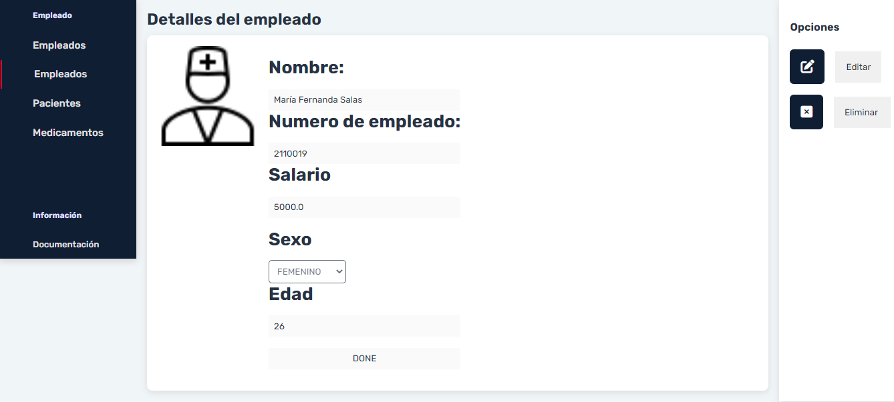

# MVC Java Project with Data Base 

It's a WebApp made with Java, HTML, CSS, MySQL.

Pattern used: Model View Controller.

Retrieves information from a database and displays it on HTML web page.

## Screenshots
It's the main screen:

You can see the database data displayed in a card set.

Also you can sort and filter to see specified results

Click on a card to see employee details.

You can enable the edit mode just by clicking on the pen icon & delete the register by clicking the X.

There's no more Maria....

Register a new employee is another feature

There's a new employee.

Consult stats of your employees

## License

[MIT](https://choosealicense.com/licenses/mit/)
